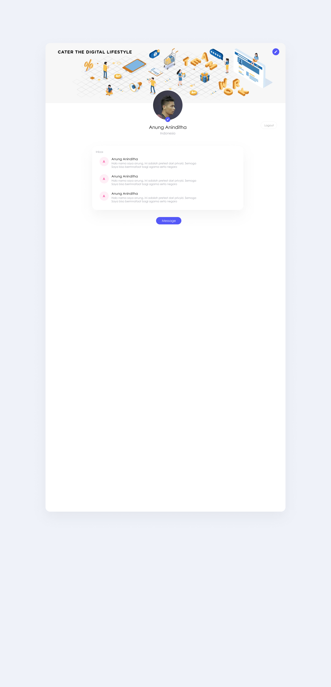

```
    PRIVY.ID TEST
```

Project untuk test ini menggunakan bahasa pemrograman javascript dengan framework vue, untuk management state menggunakan vues, styling menggunakan  scss dan scaffolding menggunakan quasar framework. 

Flow wireframe:
Sebelum saya membuat code untuk project ini, saya membuat wireframe bisa dilihat dibawah





# Sample App (privy-test)

A sample app with quasar framework

## Install the dependencies
```bash
yarn
```

### Start the app in development mode (hot-code reloading, error reporting, etc.)
```bash
quasar dev or npm run start
```

### Lint the files
```bash
yarn run lint
```

### Build the app for production
```bash
quasar build or npm run build
```

### Customize the configuration
See [Configuring quasar.conf.js](https://quasar.dev/quasar-cli/quasar-conf-js).
